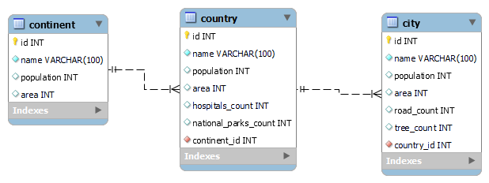

# Wiki Project

This project is POC of using RabbitMQ, Celery, SQLAlchemy and Flask as a tech stack for exposing API with Insertion/Updation/Deletion tasks being celery tasks and Get operation functioning as a normal GET API

## Components

### Flask App

`app.py` file contains the celery tasks, configuration for backend and the API defined.

### Celery

Celery processes the tasks that are called when API is invoked. Celery acts both as a producer and consumer here. Produces tasks and pushes them into Queues inside RabbitMQ, then the consumers are the workers that are spawned and pick up tasks from the Queue and process them.

Celery also stores information about the task inside the backend database.

### MySQL

MySQL is used as a backend database. MySQL stores the Wiki database as well as Celery database.

### RabbitMQ

Acts as broker for celery and stores messages.

## API Structure

| Endpoint         | Method |                                                                                 Description |                             Response                              |
| :--------------- | :----: | ------------------------------------------------------------------------------------------: | :---------------------------------------------------------------: |
| `/<type>`        |  GET   |                                                         Return all rows for a specific type | All rows as JSON Array of specified type or 204 if table is empty |
| `/<type>`        |  POST  | Insert data for specified type. Can take multiple rows at once using array of JSON elements |                              Task ID                              |
| `/<type>/<name>` | DELETE |                                                 Delete specified row of type with name=name |                              Task ID                              |
| `/<type>/<name>` |  PUT   |                                      Update values for specified row of type with name=name |                              Task ID                              |
| `/<type>/<name>` |  GET   |                                                    Get specific row with type and name=name |      JSON Object of type with name=name or 204 if not found       |
| `/task/<id>`     |  GET   |                                                      Get status of Task Corresponding to ID |                       JSON Object for Task                        |

Here `<type>` can be continent, country or city and `<name>` can be the name specified inside records

## Model Structure

## Setup instructions

### Prerequisite

1. Docker
2. Docker Compose

Execute `docker-compose -p wiki up -d` to bring up the stack
